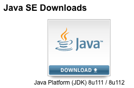
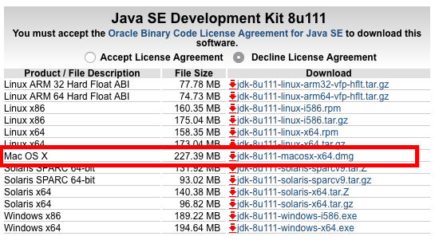
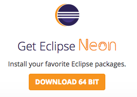
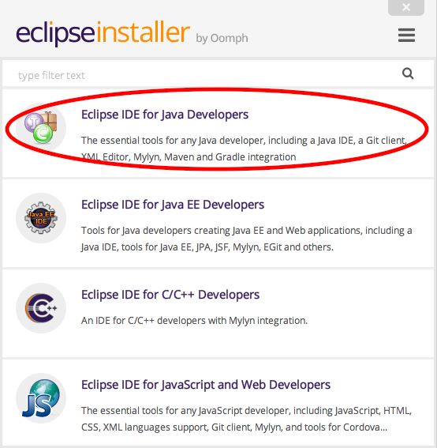

# My README

## Setup FRC Java Development Environment

This is intended to supplement the material from here: [https://wpilib.screenstepslive.com](https://wpilib.screenstepslive.com)

### Mac OS Instructions (based on macOS Sierra 10.12.2.)

 *WARNING: While you will be able to edit and compile code, it is only possible to control the robot from a Windows environment.*

 1. Download and install the latest JDK from here:
    [https://www.oracle.com/technetwork/java/javase/downloads/index.html](https://www.oracle.com/technetwork/java/javase/downloads/index.html)

 2. You should see a link at the top like the following:

     

 3. Be sure to download the correct version:

    

### Install Eclispse IDE

 1. Download and run the installer from here: 
    [https://www.eclipse.org/downloads/](https://www.eclipse.org/downloads/)

    

 2. When prompted, chose the version indicated below:

     

### Configure Eclipse

 1. Go to Go to **Window -> Preferences** and esure the following options are **checked**...

    **General -> Workspace -> Check Save automatically before build.**
    
    **General -> Workspace -> Automatically find new updates and notify me.**

 2. Click OK to save changes and exit the Preferences dialog.
 3. Click "Install new software".
 4. Click "Add..." and enter the following for name and location fields:
    Name: FRC Plugins
    Location: http://first.wpi.edu/FRC/roborio/release/eclipse/
 5. Click **OK**, **Next** then **Finish**
 6. A security warning will appear because unfortunately the packages from First contain unsigned content. You must click the **OK** button to allow the content anyways.
 7. You should be prompted to restart Eclipse, click **Yes**.

#### Optional

 - If you prefer a dark theme instead of the default one the editor uses...
    **Window -> Preferences -> General -> Appearance** then choose **Dark** from the **Theme** dropdown.
